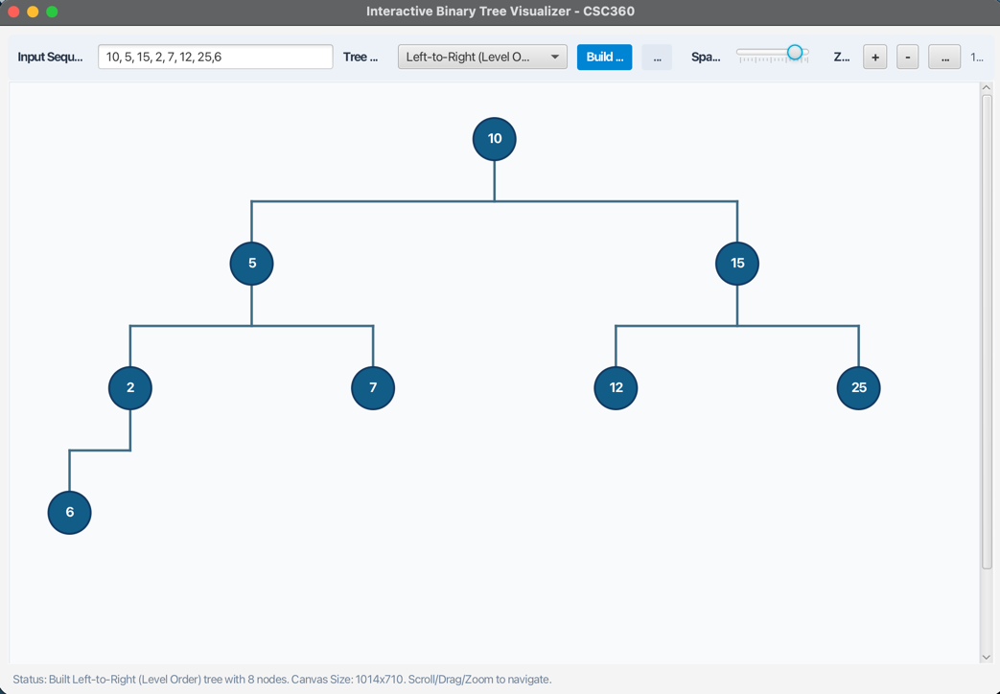

# CSC360-Group-3 — Interactive Binary Tree Visualizer

A desktop app for constructing and visualizing binary trees in real time.  
Built with **Java 21 + JavaFX 21**, managed by **Maven**.

---

## Tech Stack

| | |
|---|---|
| **Language** | Java 21 |
| **UI Framework** | JavaFX 21.0.2 |
| **Build Tool** | Maven 3.6+ |
| **Testing** | JUnit Jupiter 5.10.2 |

---

## Screenshot



---

## How to Run

**Prerequisites:** Java 21+ and Maven 3.6+ must be installed.

```bash
# Clone the repo
git clone https://github.com/PrashamMehta-04/CSC360-Group-3.git
cd CSC360-Group-3

# Run the app
mvn javafx:run

# Run tests
mvn test
```

---

## What It Does

- Enter a comma/space-separated list of numbers in the input field
- Choose a tree mode:
  - **Level-Order** — fills the tree row by row (like reading left to right)
  - **BST** — inserts each value by BST rules (smaller → left, larger → right)
- Click **Build Tree** to render
- Use the **Spacing** slider to adjust vertical gap between levels
- **Drag** the canvas to pan; **scroll** to zoom
- If you enter too many nodes, the app automatically trims them to what fits in the window and shows a warning

---

## File Structure

```
src/main/java/com/csc360/
│
├── App.java                        ← Entry point; builds the UI
│
├── model/
│   ├── TreeNode.java               ← A single node (data + left/right pointers)
│   └── BinaryTree.java             ← Container holding the root node
│
├── builder/
│   └── TreeBuilder.java            ← Converts a list → BinaryTree (Level-Order or BST)
│
├── layout/
│   ├── PositionedNode.java         ← TreeNode + its (X, Y) screen position
│   └── TreeLayoutCalculator.java   ← Calculates positions so nodes don't overlap
│
└── view/
    └── TreeCanvasPane.java         ← Draws circles, lines, and labels on screen
```

---

## Team

**CSC360 — Group 3**