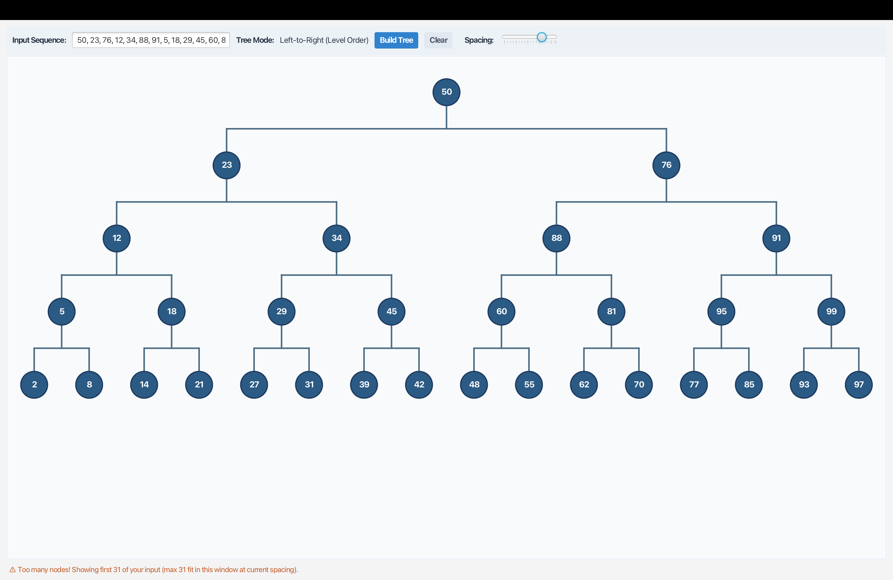

# Interactive Binary Tree Visualizer



A JavaFX-based desktop application designed to construct, render, and visually interact with **Binary Trees**. 

This project was developed as part of **CSC360 Group 3** by:

| Name | Enrollment Number |
| :--- | :--- |
| Bhavya Surati | AU2340215 |
| Shubham Mehta | AU2340210 |
| Pranel Agrawal | AU2340209 |
| Prasham Mehta | AU2340135 |

## 🌲 What is a Binary Tree?
A **Binary Tree** is a hierarchical data structure in computer science where each node has at most two children, referred to as the *left child* and the *right child*. 
- The topmost node is called the **Root**.
- Nodes without children are called **Leaves**.
- They are widely used in computing for efficiently storing, retrieving, and organizing hierarchical data. 

In this application, we build **Level-Order Binary Trees**, meaning nodes are filled level-by-level from top to bottom, left to right, exactly in the order they are provided!

## 🚀 Features

- **Custom Input Sequences**: Instantly build a tree from any comma-separated or space-separated list of integers.
- **Dynamic Layout Engine**: An underlying mathematical layout engine computes precise (X, Y) coordinates ensuring tree branches never overlap.
- **Interactive Navigation**: 
  - A real-time **Spacing Slider** allows you to dynamically adjust the vertical distance between tree levels.
- **No Node Overlap**: The precision layout guarantees branches never intersect, automatically capping insertions to a maximum of 31 nodes to prevent visual crowding.
- **Dynamic Node Limiting**: Automatically detects your window size and spacing slider value to cap the maximum number of nodes, preventing the tree from growing out of bounds or causing rendering issues with overly massive inputs. The engine limits the max depth ($d$) and max node count ($N$) using the following mathematical formulas:
  - $d_{\text{width}} = \lfloor \log_2(\frac{\text{ViewportWidth}}{\text{MinLeafSpacing}}) \rfloor + 1$
  - $d_{\text{height}} = \lfloor \frac{\text{ViewportHeight} - \text{TopMargin}}{\text{VerticalGap}} \rfloor$
  - Final Allowed Depth: $d = \max(1, \min(d_{\text{width}}, d_{\text{height}}))$
  - Max Allowed Nodes: $N = 2^d - 1$

## 🛠️ Tech Stack

- **Language**: Java 21
- **UI Framework**: JavaFX 21
- **Build Tool**: Maven
- **Testing**: JUnit 5

## ⚙️ How to Run

### Prerequisites
Make sure you have [Java 21](https://adoptium.net/) and [Maven](https://maven.apache.org/) installed on your machine.

### Option 1: Using the Command Line (Maven)
1. Open your terminal and navigate to the project directory.
2. Run the application using the Maven JavaFX plugin:
   ```bash
   mvn clean javafx:run
   ```

### Option 2: Using an IDE
1. Open the project folder in your preferred IDE (IntelliJ IDEA, Eclipse, or VS Code).
2. Ensure your IDE recognizes it as a Maven project.
3. Use your IDE's Maven tool window to execute the `javafx:run` goal. 
   *(Note: Running App.java directly via the standard play button requires explicitly configuring JVM module paths since JavaFX is not bundled natively in Java 11+).*

## 📁 Project Architecture & File Structure

The application is structured using a clear separation of concerns under a standard Maven layout:

```text
.
├── docs/                      # Documentation images
├── progress/                  # Development tracking & logs
├── src/
│   ├── main/java/com/csc360/
│   │   ├── App.java                   # Main UI entry point
│   │   ├── builder/TreeBuilder.java   # Tree construction logic
│   │   ├── layout/                    # Math engine for (X,Y) coordinates
│   │   ├── model/                     # Core data structures (BinaryTree, TreeNode)
│   │   └── view/TreeCanvasPane.java   # JavaFX rendering logic
│   └── test/java/com/csc360/          # JUnit tests mirroring main structure
├── implementation_plan.md     # Initial project planning
├── pom.xml                    # Maven configuration
└── README.md
```
