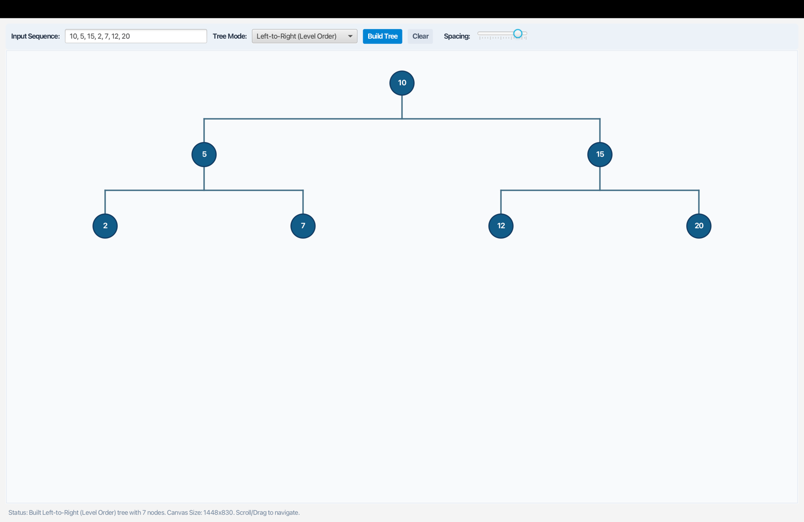

# CSC360 Group 3 — Progress So Far

## Interactive Binary Tree Visualizer

### Update: September 17, 2026

**New Feature: Dynamic Vertical Spacing & UI Cleanup**
We added a real-time slider to the control panel that allows users to adjust the vertical spacing between tree levels for a clearer view. The layout engine and canvas dimensions scale dynamically based on the slider value. Additionally, the zoom functionality and its associated UI controls have been removed to keep the interface clean and focused.



---

### Update: September 15, 2026

---

### What We've Built

We have a working **JavaFX desktop application** that allows users to interactively build and visualize binary trees. The app runs successfully via `mvn javafx:run`.

### Screenshot


---

### Current Features

- **Custom Input Sequence** — Users can type a comma-separated sequence of integers (e.g., `10, 5, 15, 2, 7, 12, 20, 1, 1, ...`) and build a tree from it.
- **Tree Mode Selection** — Supports multiple insertion modes via a dropdown; currently demonstrated with **Left-to-Right (Level Order)** traversal.
- **Visual Tree Rendering** — Nodes are rendered as styled dark-blue circles with white text, connected by edge lines on a light-gray canvas.
- **Clear Button** — Resets the canvas/input for a fresh start.
- **Vertical Spacing Slider** — Adjusts the vertical gap between tree levels in real time.
- **Status Bar** — A live status bar at the bottom shows tree statistics and canvas dimensions (e.g., *"Built Left-to-Right (Level Order) tree with 14 nodes. Canvas Size: 1028×607. Scroll/Drag to navigate."*).
- **Scroll/Drag Navigation** — The canvas supports panning by dragging for large trees.

### Tree Shown in Screenshot

The input sequence `10, 5, 15, 2, 7, 12, 20, 1, 1, 1, 1, 1, 1, 1` produces a **4-level binary tree with 14 nodes** in level-order layout:

```
             10
           /     \
          5       15
        /   \   /   \
       2     7  12   20
      / \  / \  / \  /
     1   1 1  1 1  1 1
```

---

### Next Steps

- [ ] Add support for additional tree modes (e.g., BST Insert, Pre/In/Post-Order)
- [ ] Highlight traversal paths with animation
- [ ] Export tree as image
- [ ] Add node deletion and search functionality
- [ ] Write unit tests for tree construction logic
