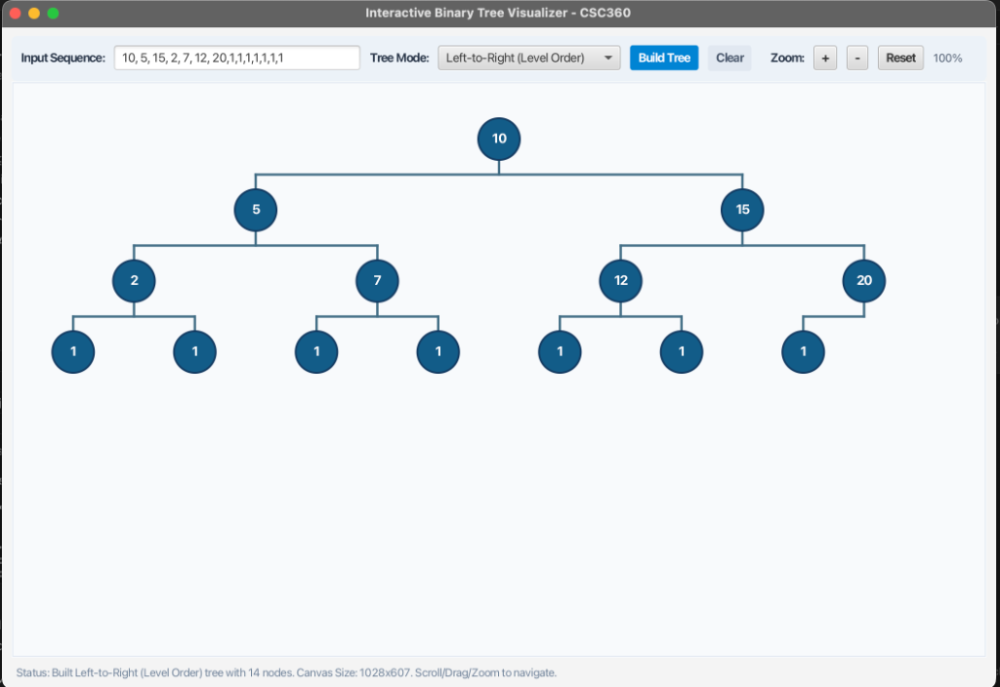

# CSC360 Group 3 — Progress So Far

## Interactive Binary Tree Visualizer

**Date:** September 15, 2026

---

### What We've Built

We have a working **JavaFX desktop application** that allows users to interactively build and visualize binary trees. The app runs successfully via `mvn javafx:run`.

### Screenshot



---

### Current Features

- **Custom Input Sequence** — Users can type a comma-separated sequence of integers (e.g., `10, 5, 15, 2, 7, 12, 20, 1, 1, ...`) and build a tree from it.
- **Tree Mode Selection** — Supports multiple insertion modes via a dropdown; currently demonstrated with **Left-to-Right (Level Order)** traversal.
- **Visual Tree Rendering** — Nodes are rendered as styled dark-blue circles with white text, connected by edge lines on a light-gray canvas.
- **Zoom Controls** — `+`, `–`, and `Reset` buttons allow zooming in/out, with the current zoom level displayed (e.g., `100%`).
- **Clear Button** — Resets the canvas/input for a fresh start.
- **Status Bar** — A live status bar at the bottom shows tree statistics and canvas dimensions (e.g., *"Built Left-to-Right (Level Order) tree with 14 nodes. Canvas Size: 1028×607. Scroll/Drag/Zoom to navigate."*).
- **Scroll/Drag/Zoom Navigation** — The canvas supports panning and zooming for large trees.

### Tree Shown in Screenshot

The input sequence `10, 5, 15, 2, 7, 12, 20, 1, 1, 1, 1, 1, 1, 1` produces a **4-level binary tree with 14 nodes** in level-order layout:

```
             10
           /     \
          5       15
        /   \   /   \
       2     7  12   20
      / \  / \  / \  /
     1   1 1  1 1  1 1
```

---

### Next Steps

- [ ] Add support for additional tree modes (e.g., BST Insert, Pre/In/Post-Order)
- [ ] Highlight traversal paths with animation
- [ ] Export tree as image
- [ ] Add node deletion and search functionality
- [ ] Write unit tests for tree construction logic
